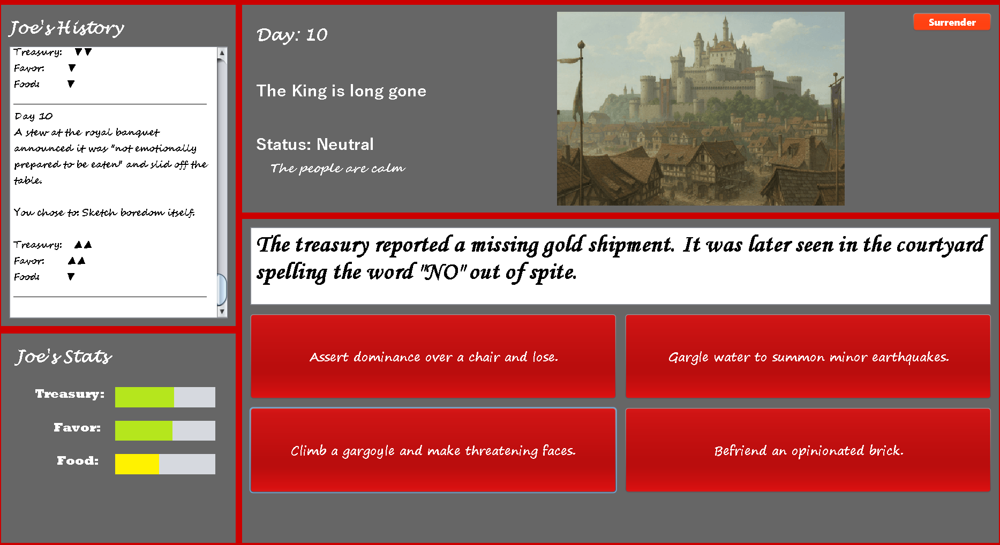
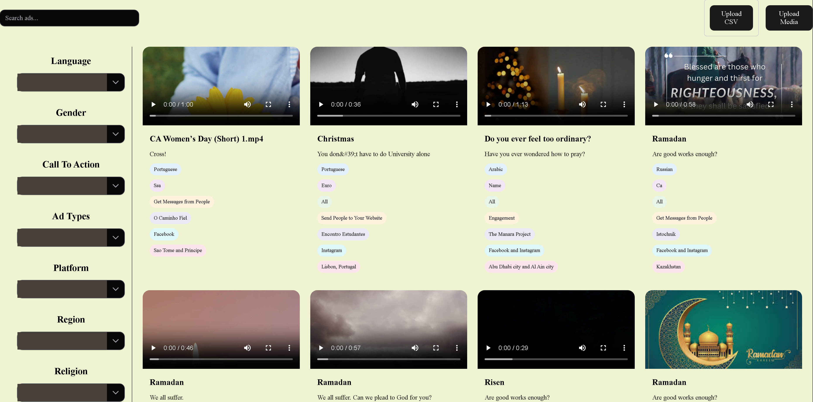
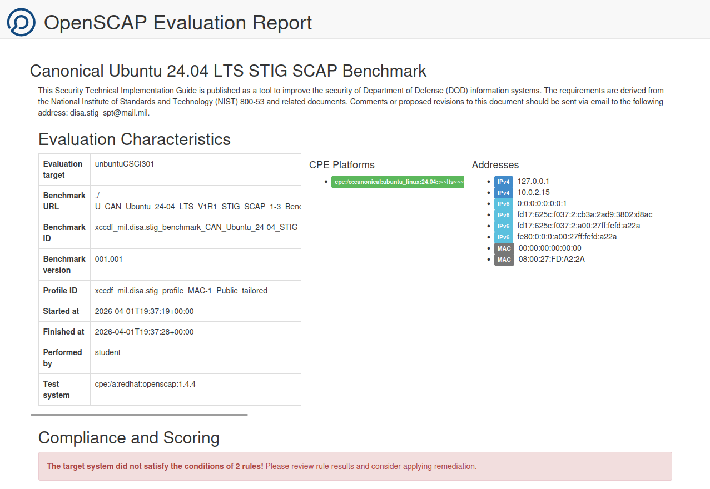
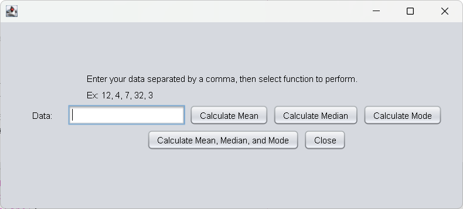

Portfolio
=========

Programming Projects
--------------------

*For access to my private project repositories, please [email me](mailto:jachristofiles@student.csuniv.edu?subject=GitHub%20Access) with the subject line, GitHub Access.

---
### [Kingdom Calamity Java Game | CSCI 325](project2)

---
### [Front-end Webpage AD-Library | CSCI 383](project3)

---
### [OpenSCAP Portable STIG Script | CSCI 301](project1)

---
### [Statisics Calculator | CSCI 325](project4)

---

Ethics Papers
-------------

### [Ad Blockers](/pdf/CSCI-235 Ethics Paper-Ad Blockers.pdf)

-   **Class:CSCI-235**  
-   **Grade:C**

### [Ethics Assignment](/pdf/CSCI-301 Ethics Assignment - Joseph.Christofiles.pdf)

-   **Class:CSCI-301** 
-   **Grade:B**

### [Ethics Paper](/pdf/CSCI-325 Ethics Paper - Joseph.Christofiles.pdf)

-   **Class:CSCI-325** 
-   **Grade:A**

---

Presentations
-------------

### [Mid-Project Brief](/pdf/CSCI-497.PDF)

- **Class:CSCI-497** 
- **Grade:Pass**

### [Secular Music Messages, Trends, and Places](https://csuniv0-my.sharepoint.com/personal/jachristofiles_student_csuniv_edu/_layouts/15/stream.aspx?id=%2Fpersonal%2Fjachristofiles%5Fstudent%5Fcsuniv%5Fedu%2FDocuments%2FSecular%20Music%20Messages%2C%20Trends%2C%20and%20Places%2Emp4&referrer=StreamWebApp%2EWeb&referrerScenario=AddressBarCopied%2Eview%2E6533d25d%2De777%2D43da%2D8fcf%2D0c57299bd06b)

- **Class:SPAN-110L** 
- **Grade:A**

---

Page template forked from <a href="https://github.com/csu-cs/csci-portfolio">CSU-CS</a>

<!-- Remove above link if you don't want to attributive -->
