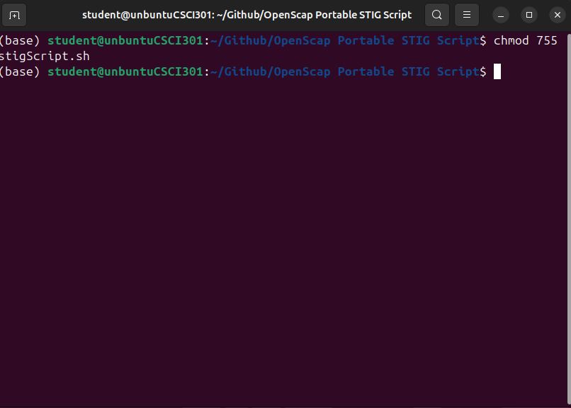
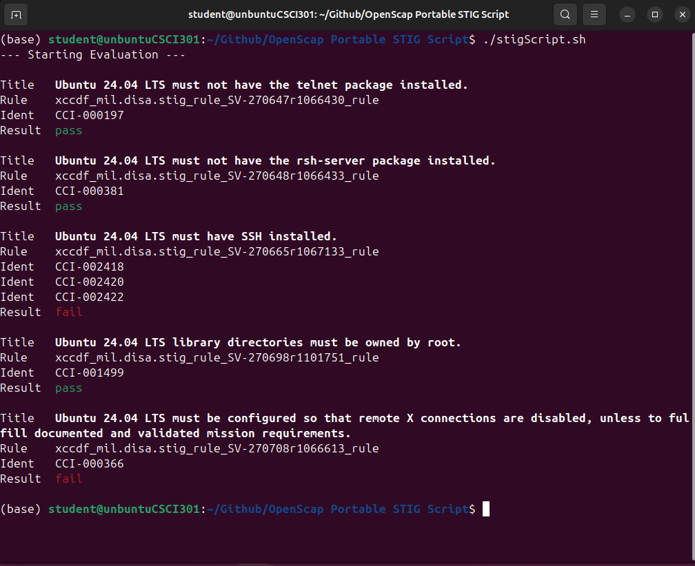
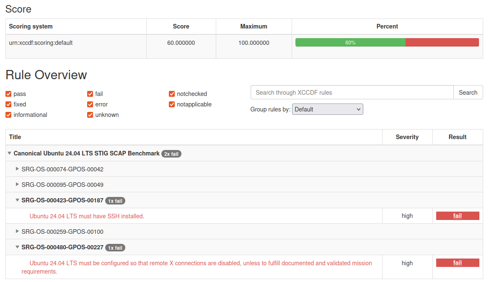

[Back to Portfolio](./)

OpenSCAP Portable STIG Script
===============

-   **Class:CSCI-301** 
-   **Grade:A** 
-   **Language(s):BASH** 
-   **Source Code Repository:** [OpenSCAP Portable STIG Script](https://github.com/JoeChristofiles/OpenSCAP-Portable-STIG-Script)  
    (Please [email me](mailto:jachristofiles@student.csuniv.edu?subject=GitHub%20Access) to request access.)

## Project description

This project implements an automated Security Technical Implementation Guide (STIG) compliance assessment for a Linux system using OpenSCAP. The program executes a DISA STIG benchmark against a target environment, applies a tailored security profile, and generates both structured XML results and a human-readable HTML report.

The implementation uses a Bash script to control execution of a portable OpenSCAP environment. Instead of installing OpenSCAP on the system, a precompiled oscap binary was bundled with its required shared libraries and supporting data files. The script configures runtime environment variables to redirect library loading and data paths to this local directory, allowing the tool to operate as a standalone package without system dependencies.

During execution, the script performs an XCCDF evaluation using a specified STIG profile and tailoring file, producing a results XML file that captures compliance status for each control. The results are then transformed into an HTML report, enabling clear analysis of passed and failed security checks.

## How to compile and run the program

How to compile (if applicable) and run the project.

```bash
cd OpenSCAP-Portable-STIG-Script/"OpenSCAP Portable STIG Script"
chmod 755 stigScript.sh
./stigScript.sh
```

## UI Design

This program is executed from the command line and does not include a graphical user interface. The user runs the script to initiate the STIG compliance scan and reviews the generated HTML report for results. All evaluation and report generation are performed automatically without additional user input.

  
Fig. 1 Assigning execution permissions to the STIG evaluation script prior to execution.

  
Fig 2. Execution of the OpenSCAP STIG evaluation script showing rule-level pass and fail results in the terminal.

  
Fig 3. OpenSCAP HTML report displaying evaluation metadata and overall compliance status.

  
Fig 4. Detailed STIG rule results highlighting failed security controls and associated severity levels.

For more details see [OpenSCAP Portable STIG Script](https://github.com/JoeChristofiles/OpenSCAP-Portable-STIG-Script).

[Back to Portfolio](./)