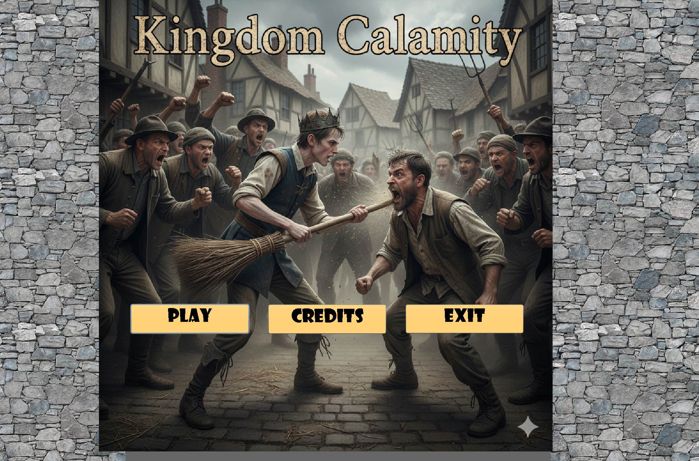
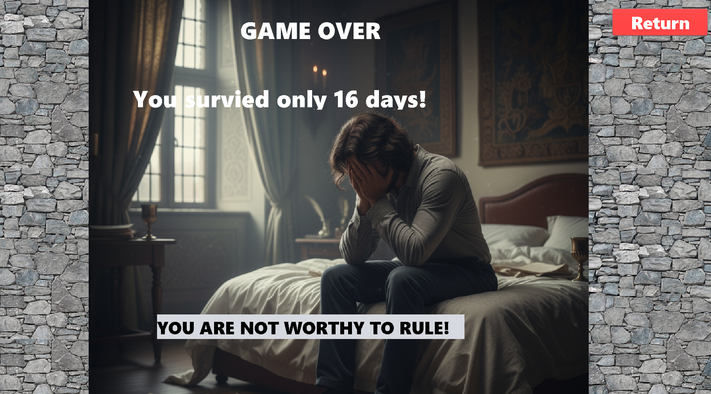
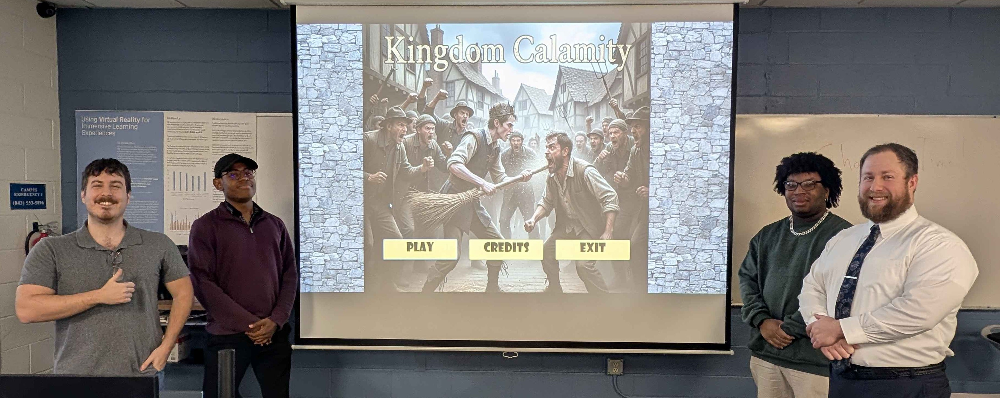

[Back to Portfolio](./)

Kingdom Calamity
===============

-   **Class:CSCI-325** 
-   **Grade:A** 
-   **Language(s):JAVA** 
-   **Source Code Repository:** [DND Clones](https://github.com/JoeChristofiles/csci325-fall25-DND-Clones)  
    (Please [email me](mailto:jachristofiles@student.csuniv.edu?subject=GitHub%20Access) to request access.)

## Project description

This project is a state-driven, turn-based simulation game developed in Java using a modular architecture. The system is built around a centralized game loop managed by a controller that coordinates game state, event selection, and user interaction through a graphical interface.

Game progression is driven by a structured event pipeline. Text-based resources are loaded into categorized datasets, which are then used to dynamically generate gameplay events. Event selection is determined by the current game state, allowing the system to adapt behavior based on player performance metrics such as food, wealth, and favor.

A randomized but controlled selection process ensures variability while preventing repetition, maintaining consistency across gameplay sessions. Player decisions trigger updates to the underlying state model, which directly influences future event categories and outcomes. This creates a closed-loop system where state continuously informs behavior.

My primary contribution focused on backend system design, including implementation of the file ingestion layer, event selection logic, and state-based event routing. This included developing mechanisms for categorizing events, managing event lifecycles, and integrating structured data into runtime decision-making.

## How to run the program

This program requires Java 25 or later to be installed on the system.

The executable version of the project is provided as a `.jar` file in the GitHub release.

Double-click the provided launcher:

```bat
run-game.bat
```
or to manually run, navigate to csci325-fall25-DND-Clones\DND_Clone\dist:

```bash
java -jar DNDClone.jar
```

## UI Design

This application uses a Java Swing-based interface to present gameplay and capture user interaction. The user launches the game from the main menu, views current game state including day count, food, wealth, and favor, reads dynamically generated event prompts, and selects from multiple decision options. The interface updates in real time based on user input and maintains a log of previous decisions, allowing the user to observe how each action affects overall progression.

  
Fig 1. Main menu interface

  
Fig 2. Gameplay screen showing event prompt, choices, and gamestate indicators

  
Fig 3. Game outcome screen following win or loss condition

  
Fig 4. Team presentation and demo of Kindgom Calamity

For more details see [DND Clones](https://github.com/JoeChristofiles/csci325-fall25-DND-Clones).

[Back to Portfolio](./)