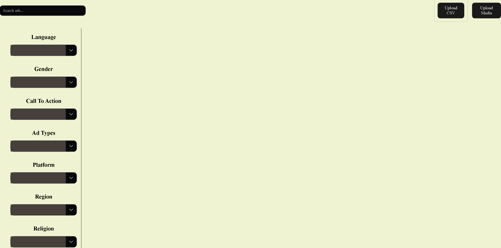
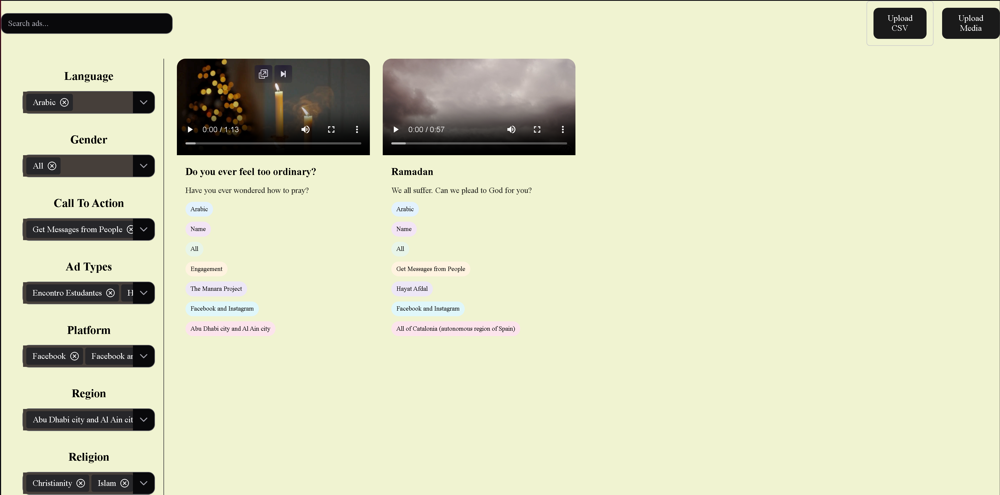
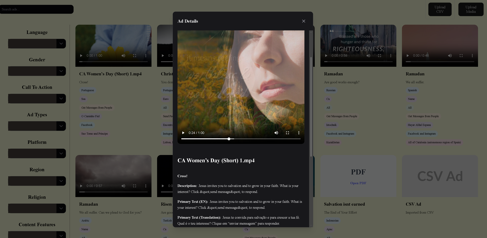
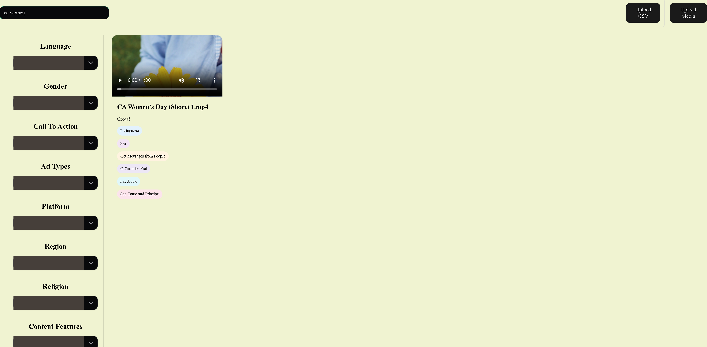

[Back to Portfolio](./)

AD-Library
===============

-   **Class:CSCI-383** 
-   **Grade:Delivered / Accepted** 
-   **Language(s):JavaScript, Vue, CSS, HTML** 
-   **Source Code Repository:** [AD-Library](https://github.com/JoeChristofiles/CSCI-383)  
    (Please [email me](mailto:jachristofiles@student.csuniv.edu?subject=GitHub%20Access) to request access.)

## Project description

This project is a frontend prototype of a searchable advertisement library built for a client. It replaces folder-based storage in Sharepoint with a structured system that allows users to search, filter, and explore ad content without relying on inconsistent file naming or manual organization.

The application is built with Vue 3 using a component-based architecture, with core logic separated into composables for ad ingestion, normalization, and filtering. The system supports CSV metadata and local media uploads, both of which are mapped into a unified ad object model used throughout the application.

A key challenge was handling inconsistent real-world data. Fields such as language, gender, platform, and action are normalized to ensure consistent filtering, while additional metadata (religion, holidays, keywords, emotions) is derived from content to extend filtering beyond the original dataset.

Filtering is handled through a composable that computes filter values dynamically and applies multi-dimensional filtering in real time. Search operates across multiple mapped fields, allowing users to locate ads without exact matches.

This project was developed as part of a team effort, with work contributing to system design, project structure, and coordination throughout development.

## How to run the program

This is a Vue 3 application built with Vite and is run from the project root directory.

```bash
npm install
npm run dev
```

## UI Design

This application uses a web-based interface that allows the user to search, filter, and inspect advertisement records without relying on folder navigation or raw metadata. The user can upload CSV files, upload local media, search across multiple fields, apply filters, and open individual ads for detailed viewing. All interaction occurs through the interface, with results updating dynamically based on user input.

  
Fig 1. Main library view before csv upload

  
Fig 2. Main library view showing ad cards, search, and filter controls.

  
Fig 3. Filter interface used to narrow ads by structured metadata fields.

  
Fig 4. Detailed ad view showing expanded metadata and media content.

  
Fig 5. Keyword search filter through multiple mapped fields.

## 3. Additional Considerations

**Completed:**

* CSV ingestion and normalization
* Media upload integration
* Unified ad data model
* Dynamic filtering system
* Search integration
* Component-based architecture

**Known Limitations:**

* No backend or persistence layer
* Data must be manually uploaded each session
* SharePoint is not yet integrated

**Future Direction:**

* Replace CSV upload with SharePoint data sources
* Replace local media with SharePoint-hosted assets
* Use SharePoint lists or exported data instead of manual CSV upload
* Use SharePoint document libraries for media


For more details see [AD-Library](https://github.com/JoeChristofiles/CSCI-383).

[Back to Portfolio](./)