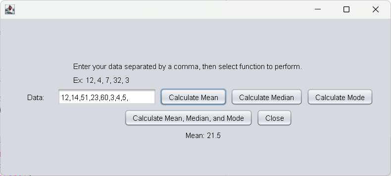
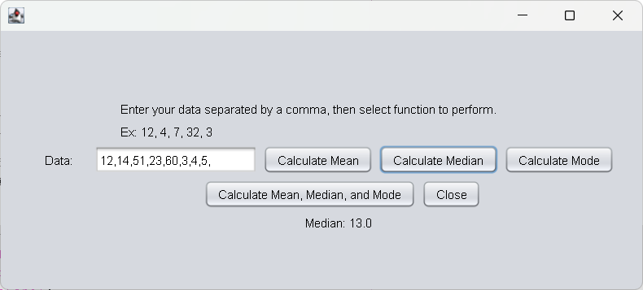
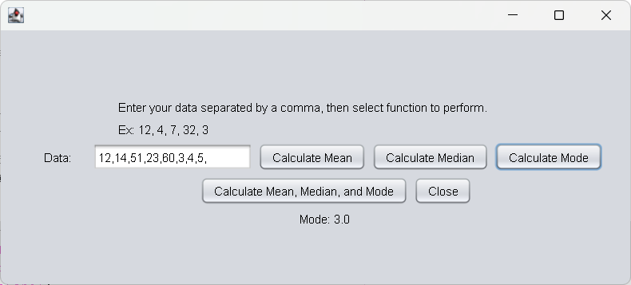
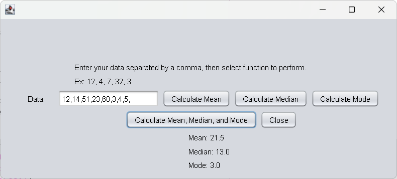

[Back to Portfolio](./)

Statistics Calculator
===============

-   **Class:CSCI 325** 
-   **Grade:A** 
-   **Language(s):Java** 
-   **Source Code Repository:** [Statistics Calculator](https://github.com/JoeChristofiles/Statistics-Calculator)  
    (Please [email me](mailto:jachristofiles@student.csuniv.edu?subject=GitHub%20Access) to request access.)

## Project description

This program is a Java Swing-based statistics calculator for mean, median, and mode. The user enters comma-separated values, which are parsed into numbers and processed using basic loops and sorting. Each button runs its own calculation, keeping the logic simple and separated. Results are then displayed directly on the interface and update with each action.

## How to compile and run the program

This program requires Java 25 or later to be installed on the system.

The executable version of the project is provided as a `.jar` file in the GitHub release.

Double-click the provided launcher:

```bat
run-game.bat
```
or to manually run, navigate to Statistics-Calculator\dist:

```bash
java -jar StatisticsCalculator.jar
```

## UI Design

The UI uses a simple Java Swing layout built for direct use. The user enters comma-separated numbers into one input field, then selects a button to calculate mean, median, mode, or all three. Instructions and an example are shown on screen so the input format is clear. Results update directly on the interface through labels, keeping the design simple and easy to follow.

  
Fig 1. The launch screen showing input field and button options

  
Fig 2. Mean calculation output display

  
Fig 3. Median calculation output display

  
Fig 4. Mode calculation output display

  
Fig 5. Mean, median and mode calculation output display


For more details see [Statistics Calculator](https://github.com/JoeChristofiles/Statistics-Calculator).

[Back to Portfolio](./)